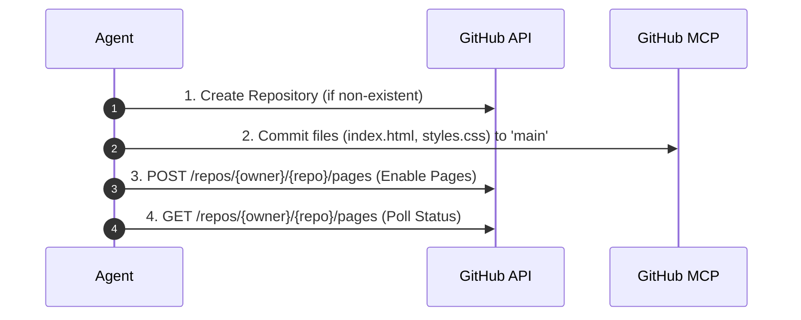

# Deploy Site to GitHub Pages

This skill guides an AI agent through provisioning a repository, committing static files or build workflows, and enabling GitHub Pages hosting via API.

---

## Prerequisite Checks

1. **Verify Token Permissions**: Ensure `GITHUB_TOKEN` or `GITHUB_PERSONAL_ACCESS_TOKEN` has the following scopes:
   - `repo` (Full control of private/public repositories)
   - `workflow` (Required if using GitHub Actions pipelines)
2. **Identify Build Type**:
   - **Static HTML/CSS/JS**: Deploy directly from the `main` or `gh-pages` branch using root `/` or `/docs`.
   - **Frameworks (React, Vite, Vue, Next.js)**: Configure a `.github/workflows/deploy.yml` file to build artifacts on GitHub runners.

---

## Deployment Procedures

### Workflow A: Direct Static Deployment (Single File / Raw Web Assets)

Use this flow when deploying standard HTML, CSS, and client-side JavaScript without a compilation step.



#### Step 1: Push Static Files

Using `github-pages-mcp-server` or `server-github`:

* Commit `index.html` to branch `main` at path `/`.

#### Step 2: Enable GitHub Pages Source

Execute the `enable_github_pages` MCP tool, or trigger the REST endpoint:

```http
POST /repos/{owner}/{repo}/pages HTTP/1.1
Host: api.github.com
Authorization: Bearer <GITHUB_TOKEN>
Accept: application/vnd.github+json
Content-Type: application/json

{
  "source": {
    "branch": "main",
    "path": "/"
  }
}
```

#### Step 3: Verify Deployment

Poll `get_github_pages_info` or check status via API:

```http
GET /repos/{owner}/{repo}/pages HTTP/1.1
Host: api.github.com
Authorization: Bearer <GITHUB_TOKEN>
```

*Expected response `status`: `built` or `building`.*

---

### Workflow B: Automated Build Deployment (Vite / React / Vue / Next.js)

Use this flow for projects requiring `npm run build` or custom compilation.

#### Step 1: Create GitHub Actions Workflow File

Write the following YAML definition to `.github/workflows/deploy.yml` in the project repository:

```yaml
name: Deploy to GitHub Pages

on:
  push:
    branches: ["main"]
  workflow_dispatch:

permissions:
  contents: read
  pages: write
  id-token: write

concurrency:
  group: "pages"
  cancel-in-progress: true

jobs:
  deploy:
    environment:
      name: github-pages
      url: ${{ steps.deployment.outputs.page_url }}
    runs-on: ubuntu-latest
    steps:
      - name: Checkout
        uses: actions/checkout@v4

      - name: Setup Node.js
        uses: actions/setup-node@v4
        with:
          node-version: 20
          cache: 'npm'

      - name: Install Dependencies
        run: npm ci

      - name: Build Static Artifacts
        run: npm run build

      - name: Upload Pages Artifact
        uses: actions/upload-pages-artifact@v3
        with:
          path: './dist' # Update to './build' or './out' based on framework

      - name: Deploy to GitHub Pages
        id: deployment
        uses: actions/deploy-pages@v4
```

#### Step 2: Configure Pages to Use GitHub Actions

Update the repository's Pages build type via API:

```http
PUT /repos/{owner}/{repo}/pages HTTP/1.1
Host: api.github.com
Authorization: Bearer <GITHUB_TOKEN>
Content-Type: application/json

{
  "build_type": "workflow"
}
```

---

## Troubleshooting & Verification Checklist

| Symptom / Error | Cause | Resolution |
| --- | --- | --- |
| **404 Not Found** | Deployment build hasn't finished or path is wrong. | Check `https://github.com/{owner}/{repo}/actions` or poll `get_github_pages_info`. Ensure `index.html` is at root. |
| **403 Forbidden on API Call** | Missing token permissions. | Verify token has `repo` and `workflow` scopes enabled. |
| **Assets Fail to Load (MIME errors)** | Broken base URL paths in framework build. | For Vite, add `base: '/<repo-name>/'` in `vite.config.js`. |
| **Custom Domain SSL Pending** | DNS record propagation in progress. | Verify `CNAME` points to `<username>.github.io`. |

---

## Completion Verification

Once deployed, confirm the operational status by verifying:

1. HTTP status **200 OK** at `https://<username>.github.io/<repo-name>/`.
2. Pages settings endpoint confirms `status: "built"`.
